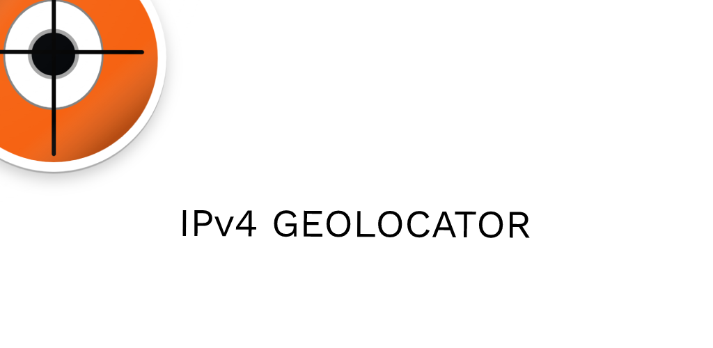

IPv4 Geolocate
==========
# A IPv4 Geolocation Tool ---- Severside 

Severside written in [GO](https://go.dev/)
User-interface written in [Flutter](https://flutter.dev/) found here: [Geolocate](https://github.com/ericwarriner/Geolocate)

A long overdue update to an application the I published over a decade ago found here:
[GitHub](https://github.com/ericwarriner/ericonjava/tree/master/IpGeolocate).
in an new effort to learn the magic of the ✨<Magic>✨ [Flutter](https://flutter.dev/) framework and [Dart.js](https://dart.dev/) ✨</Magic> ✨.

As per licensing - [Attribution-ShareAlike 4.0 International (CC BY-SA 4.0)](https://creativecommons.org/licenses/by-sa/4.0/)
 This product includes GeoLite2 data created by MaxMind, available from [MaxMind](https://www.maxmind.com). 

Special thanks to maxmind as this app would not be possible without their data. Also, if you found this app helpful in any way please consider purchasing one their commercial products for your enterprise.

Lastly, regarding the Maxmind GeoLite2 database in use... their documentation clearly states that: "Latitude and Longitude results are not precise and should not be used to identify a particular street address or household"